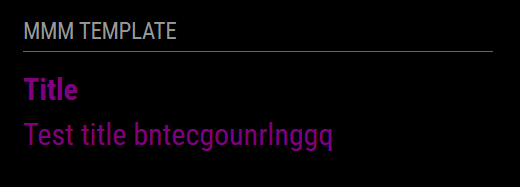

# MMM-Template
Use this template for creating new MagicMirror² modules.

See the [wiki page](https://github.com/Dennis-Rosenbaum/MMM-Template/wiki) for an in depth overview of how to get started.

# MMM-Template

*MMM-Template* is a module for [MagicMirror²](https://github.com/MagicMirrorOrg/MagicMirror) that displays ... [Module description]

## Screenshot



## Installation

### Install

In your terminal, go to the modules directory and clone the repository:

```bash
cd ~/MagicMirror/modules
git clone [GitHub url]
```

### Update

Go to the module directory and pull the latest changes:

```bash
cd ~/MagicMirror/modules/MMM-Template
git pull
```

## Configuration

To use this module, you have to add a configuration object to the modules array in the `config/config.js` file.

### Example configuration

Minimal configuration to use the module:

```js
    {
        module: 'MMM-Template',
        position: 'lower_third'
    },
```

Configuration with all options:

```js
    {
        module: 'MMM-Template',
        position: 'lower_third',
        config: {
            exampleContent: 'Welcome world'
        }
    },
```

### Configuration options

Option|Possible values|Default|Description
------|------|------|-----------
`exampleContent`|`string`|not available|The content to show on the page

## Sending notifications to the module

Notification|Description
------|-----------
`TEMPLATE_RANDOM_TEXT`|Payload must contain the text that needs to be shown on this module

## Developer commands

- `npm install` - Install devDependencies like ESLint.
- `node --run lint` - Run linting and formatter checks.
- `node --run lint:fix` - Fix linting and formatter issues.

## License

This project is licensed under the MIT License - see the [LICENSE](LICENSE.md) file for details.

## Changelog

All notable changes to this project will be documented in the [CHANGELOG.md](CHANGELOG.md) file.
